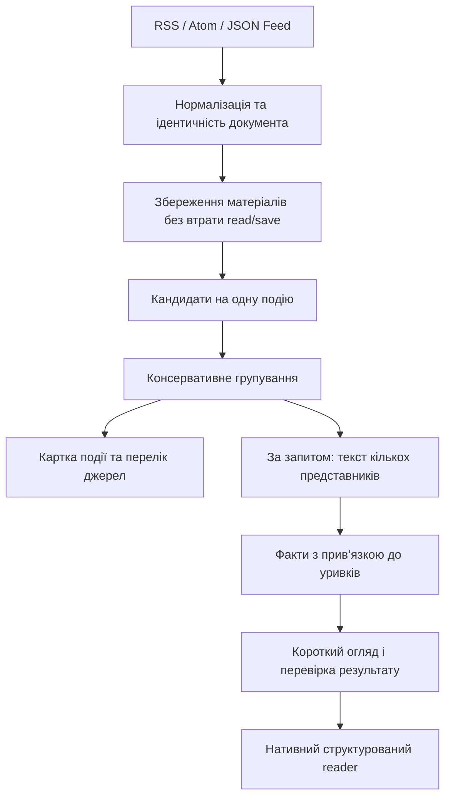

# News: структуроване читання та огляди подій

План від 30 вересня 2026. Статус: виконується; поточний стан наведено нижче та в [#90](https://github.com/marspater/NewsApp-macOS/issues/90). Основа: поточний код News на `codex/kite-practices`, дослідження Kite на коміті `08d15108f82fb8728832f55fc8c3799a2836bfd6` та чотири надані скриншоти. Незакомічені попередні зміни збережено.

## Зміна обсягу — 5 жовтня 2026

Рішення Mars: перший реліз — **лише англійською**.

- Каталог пропонує тільки англомовні канали (`FeedCatalog.supportedLanguages`). Канали українською, німецькою, французькою, італійською, нідерландською й польською лишаються в коді як відкладені, а попередні підписки на них знімаються під час запуску (#269). Причина: macOS не має моделі частин мови для цих мов, тож їхні матеріали не утворюють подій; словниковий fallback не пройшов перевірку точності на живих даних (#264, відкладено).
- Живу перевірку VoiceOver (мовлення, ротор, рівні заголовків) відкладено (#268); #155 закрито. Нативна доступність у коді лишається.
- Задачі з міткою `parked` не входять у реліз; братися за них лише після рішення Mars.
- Holdout подій виміряно один раз: точність 0.958 (23/24) проти цілі ≥97%, повнота 0.291; Mars прийняв результат 5 жовтня 2026 — у #102 ([аудит](../audits/2026-10-05-event-corpus-holdout.md)). Embeddings не впроваджено (#127).

## Current release status — 5 October 2026

| Work | Current state | Remaining acceptance |
| --- | --- | --- |
| Performance #104/#153 | Done; PR #271 merged at `617c934` | Documented workload limits remain; no new performance task |
| Phase C #93 | Done; extraction #246/#261 and native QA #123/#155 complete | Spoken VoiceOver is parked in #268 |
| Phase E #95 | Done for deterministic overviews; integration, provenance and shared QA complete | No new model path or model audit in this release |
| Phase A/B #91/#92 | Acceptance complete; closure pending final evidence PR merge | #102 fingerprint holdout passed |
| Final verification/program #98/#90 | In review with final evidence consolidation | Merge the final evidence PR |
| Optional #99/#235 and #244 | Backlog, outside core release | No new work in this completion queue |

#102's event holdout is accepted by Mars (23/24, recall 0.291); it was not replayed and the matcher is unchanged. PR #272 is merged at `7ffc3e3`, limiting capture/review to the English-only policy while preserving historical files. Count-only readiness established 841 distinct eligible held-out English documents without comparing pairs, reading labels or writing review files. The final fingerprint acceptance then ran once: zero different-URL matches, undefined precision, Wilson 95% false-merge upper bound **0.455%**, and `releaseGatePassed=true`. [Final holdout and core evidence reconciliation](../audits/2026-10-05-core-release-acceptance.md). The core phases are ready to close when this final evidence PR merges. Non-English matching #264 and live VoiceOver #268 remain parked; optional #99/#235/#244 remain outside the release. Existing capture scheduling was not changed or duplicated; further samples are not required for this gate.

The earlier progress table below is a dated snapshot, superseded by this reconciliation.

## Поточний прогрес — 3 жовтня 2026 (вечір)

Злито в `main`: ідентичність і дедуплікацію (B), reader і зображення (C), кластеризацію подій і стабільну стрічку (D), детерміновані огляди з доказами (E), додаткові секції (F), каталог і refresh (G), а також інструменти оцінювання (A). Огляди доступні за запитом у reader; шлях генеративної моделі поки не має викликів. Реалізація не замінює відкриті перевірки якості та нативного інтерфейсу.

| Етап | Стан | Що лишилося |
| --- | --- | --- |
| A | Фікстури, інструменти корпусу та пробу моделі злито; baseline запуску й пам’яті застосунку (#234), реальне оновлення й скасування через HTTPS (#239) виміряно | Розмічений holdout (#102); холодний запуск після `purge` і пам’ять під час читання (#104) |
| B | Реалізацію завершено; цільовий збір 3 жовтня не дав жодного збігу відбитків з різними URL, тому ворота переглянуто | Хибні злиття відбитками ≤1% придатних holdout-документів (різних канонічних URL; верхня межа Wilson 95%) на свіжому захопленні; precision ≥99%, щойно є 100 збігів (#102) |
| C | Реалізацію завершено; нативну перевірку доступності (#123) закрито (#240); причину «стіни тексту» знайдено скануванням 98 матеріалів і виправлено (#241); межі статті та «меблі» сторінки виправлено (#242, #245: збої витягу 14 → 4 з 96) | Сторінки від користувача, якщо є (#115); структурні сигнали для віджетів і карток (#246) |
| D | Реалізацію завершено; нативну перевірку (#155) закрито (#240); підтримку мов embeddings на реальному Mac зафіксовано (#243: en, de) | Рішення щодо holdout 0.958 (23/24) проти цілі ≥97% (#102); embeddings не впроваджено (#127); не-англійські мови відкладено (#264) |
| E | Детермінований огляд інтегровано в reader (#219, #222); нативну перевірку (#155) закрито (#240) | Аудит моделі лише після підключення генеративного шляху (#95) |
| F | Завершено | — |
| G | Завершено | — |
| H | Міграції (схема v15), мережу/сон і supersession оглядів перевірено; Reduce Motion виправлено; скасування під час парсингу (#233), запуск (#234) і скасування через TLS реальних видавців (#239) виміряно; нативну перевірку з системними налаштуваннями на ізольованій збірці виконано (#240) | Пам’ять під час читання та завантаження зображень (#153) |
| I | Методику (#157), калібрування на синтетичній вибірці (#158), opt-in збір (#160) і вікно з графіком (#159) злито | Реальна вибірка панелі показує насичення шкали v1 на 95–100; повторне калібрування на кількох тижнях зібраних даних (#235) — до цього індекс не випускати; збір увімкнено ще не було |

Пороги точності на holdout ще не виміряні; наведені числа залишаються цілями. Датовані докази кожного зрізу, починаючи з [першого](../audits/2026-10-01-story-foundation.md), — у [`docs/audits/`](../audits/).

Поточні зрізи перевірки #104/#153: [інтегрований baseline і бюджети](../audits/2026-10-02-integrated-performance-budgets.md), [скасування парсингу](../audits/2026-10-02-feed-parsing-cancellation.md) та [запуск і пам’ять застосунку](../audits/2026-10-02-launch-baseline.md) (медіана 656.8 мс від старту процесу до першої картки на 10 000 матеріалів, пік 88.2 MiB) та [оновлення й скасування через HTTPS](../audits/2026-10-03-publisher-cancellation.md) (12 стрічок за 0.7–1.5 с; зупинка за медіаною 1.0 мс). Незмінний архів не запускає повторне зіставлення; щільний stress-тест 200 матеріалів виміряно окремо від refresh. Ці вимірювання не закривають холодний запуск після `purge`, пам’ять під час читання або holdout.

## Рішення

Це можливо без переходу на вебстек і без обов’язкового сервера. Залишаємо SwiftUI/AppKit, SQLite, захищений мережевий клієнт та локальну обробку. Перший результат — менше повторів і значно кращий reader. Далі — групування матеріалів про одну подію, і лише після перевірки якості — згенеровані огляди з посиланнями на докази.

Важлива межа: дедуплікація документа, кластеризація події та синтез огляду — три різні задачі. Одна не замінює інші. Багато видавців, які передрукували одну агенцію, не дорівнюють багатьом незалежним підтвердженням.

## Що вже є і чого бракує

| Поточний компонент | Повторно використовуємо | Потрібне доповнення |
| --- | --- | --- |
| `ArticleIdentity`, SQLite та article state | URL/GUID, збереження, історія читання | Узгодження кількох ідентифікаторів одного документа без втрати стану |
| `FeedFetcher`, `RefreshCoordinator` | Обмежений паралелізм і спільний refresh | Інкрементальні зміни, умовні HTTP-запити, backoff |
| `ContentExtractionPipeline`, `ReaderDocument` v2 | Абзаци, заголовки, цитати, списки, код | Зображення, підписи, атрибуція, форматування всередині тексту |
| `ArticleCardView`, `ArticleDetailView` | Нативні картки та reader | Вибір зображення і окремий режим огляду події |
| `ArticleIntelligence`, `EnrichmentQueue` | Локальна модель, типізований результат, черга, fallback | Витяг доказів із кількох матеріалів, перевірка посилань, актуальності та чисел |

У reader вже є структура тексту: проблему «стіни тексту» треба простежити на конкретних сторінках через extraction → persistence → rendering, а не просто вставити декоративні заголовки. `ReaderBlock` наразі не має figure/image/caption. Аналізатор обмежує вхід першими 6000 символами; цього недостатньо для надійного огляду кількох джерел.

GUID зараз має пріоритет над URL. Зміна GUID при незмінному URL — один зі сценаріїв повторів, який потрібно відтворити. Також перевіряємо перетин RSS-каналів, різні URL одного документа, оновлення дат і передруки. Це кандидати на причину, а не підтверджений діагноз усіх повторів у користувача.

## Майбутня поведінка

### Стрічка

Зберігаємо нинішні картки: зображення, заголовок, короткий зміст, дата, read/save. Для підтвердженого кластера — одна картка події та «5 джерел · оновлено…». Усередині доступні всі матеріали. Користувач може перейти до режиму окремих публікацій; фільтр конкретного джерела не повинен приховувати його матеріал через вибір іншого представника кластера.

Новини не перескакують під курсором під час читання. Оновлення накопичуються з явним індикатором. Збереження конкретної статті залишається доступним і незалежним від подальшого перегрупування.

### Reader

Два зрозуміло підписані режими: **Огляд події** та **Публікація джерела**. Власний текст видавця не підміняється AI-переказом.

Огляд має таку послідовність:

1. Заголовок, час оновлення, кількість матеріалів і видавців.
2. Короткий вступ: один-два абзаци.
3. Доречне основне зображення з підписом і джерелом.
4. Три-п’ять основних фактів із посиланнями.
5. Компактний список джерел із розгортанням.
6. За наявності доказів: хронологія, позиції учасників, тематичний ракурс.
7. Посилання на оригінальні публікації.

Секції без достатніх даних відсутні. Немає обов’язку заповнювати кожен шаблон. Посилання на факт відкриває конкретний матеріал і, коли збережено відповідний уривок, показує його. Цитати відтворюються з джерела, а не генеруються від імені людини.

Ширина колонки, інтерліньяж і відступи адаптуються до вікна та розміру тексту. Потрібні виділення/копіювання, клавіатурна навігація, VoiceOver, light/dark, Increase Contrast і Reduce Motion. Native disclosure, toolbar, menu commands та Swift Charts достатні; вебрендерер для цього не потрібний.

## Послідовність обробки

### 1. Дедуплікація

- Ідентифікувати документ за перевіреними URL, feed-scoped GUID та відбитком вмісту; не робити назву єдиним ключем.
- Перевірити чинну URL-нормалізацію: не відкидати параметри, що змінюють документ. Canonical/redirect — сигнал після мережевої перевірки, а не дозвіл довіряти довільному URL.
- Додати мінімальне збереження alias → існуючий article ID. Не переписувати всі первинні ключі і не видаляти історію.
- Точні дублікати показувати один раз; передруки інших видавців залишати джерелами події.
- Невизначений збіг не об’єднувати автоматично. Збережені оригінали мають залишатися доступними після міграції.

### 2. Кластеризація

Спочатку недорога вибірка кандидатів за часовим вікном, мовою, ключовими сутностями і словами через поточну базу. Потім оцінка збігу події: хто, що сталося, де і коли. Самої подібності заголовків недостатньо: квартальні звіти однієї компанії та різні удари в одному регіоні — різні події.

Стартуємо з детермінованих ознак. Native embeddings додаємо, лише якщо вони покращують контрольну вибірку; перевіряємо підтримку мови. Не припускаємо, що вектори різних мов можна безпосередньо порівнювати. LLM не має вирішувати кожну пару під час refresh.

Не порівнюємо весь архів з усім архівом. Обмежуємо кандидатів і тривалість активного кластера. Перевіряємо сумісність з усією подією, щоб ланцюг A≈B≈C не склеїв непов’язані A та C. Для раннього релізу краще пропустити зв’язок, ніж неправильно об’єднати новини.

Зберігаємо стабільний ID події, членство і версію. Об’єднання/розділення не повинні ламати посилання чи read/save. «Прочитав огляд версії 2» не означає «прочитав усі майбутні статті». Нові суттєві дані позначаємо оновленням, а не повторною новиною. Спочатку ручне «це різні події» може бути локальним виключенням; навчальний backend не потрібний.

### 3. Модель даних

Зберігаємо `FeedArticle`. Додаємо лише необхідні сутності: подія, її учасники-статті, похідний документ огляду. Посилання в огляді зберігають ID статті та ID/відбиток доказового уривка. Документ прив’язаний до версії членства, hash текстів, версії схеми й аналізу. Зміна вхідних даних робить попередній огляд застарілим.

Міграції транзакційні, перевіряються на копії тестової бази. Старі текстові reader-документи залишаються читабельними. Не копіюємо весь текст джерел у кожен кластер. Видалення старих даних узгоджуємо зі збереженими статтями та доказами: посилання не повинні мовчки вести в нікуди.

### 4. Локальний синтез

Для першої версії беремо 2–5 змістовно різних представників, а не всі десятки передруків. Відбираємо релевантні уривки, окремо витягаємо факти, після цього стисло формулюємо огляд. Ліміт контексту враховує інструкції, схему та відповідь; символи не є токенами.

Foundation Models може допомогти з коротким викладом і витягом фактів. Це не гарантія істинності. Типізована генерація гарантує форму результату, але не правильність прив’язки твердження до джерела. Перевіряємо існування citation ID, наявність опорного тексту, числа, одиниці, валюту, дати, заперечення та атрибуцію; семантичну якість оцінюємо на розміченій вибірці. Самоперевірка тією ж моделлю не замінює цей контроль.

Сторонній текст — дані, ніколи інструкції для моделі. Генерація не отримує права виконувати дії чи довільно ходити за URL. При непідтверджених твердженнях показуємо перевірені витяги та список джерел, а не зберігаємо невдалий переказ як готовий.

Перевіряємо availability і мови під час виконання. На macOS 15 або без доступної Apple Intelligence працюють reader, дедуплікація, список джерел і детерміноване групування. Українська генерація та міжмовне групування — окрема перевірка, не обіцянка; перший реліз підтримує лише англійські канали (#264). Cloud AI чи завантаження іншої моделі не входять у базовий план.

### 5. Timeline, perspectives, angle, sentiment

- **Timeline:** дата самої події, окремо дата публікації. Невідома дата залишається невідомою; майбутній план позначається як план. Кожен пункт має джерело.
- **Perspectives:** явно атрибутовані позиції учасників або видавців. Не вигадуємо «другу сторону» і не робимо вигляд, що передруки незалежні.
- **Angle:** тематичний підбір наявних фактів, наприклад фінансових показників; не прогноз і не інвестиційна рекомендація.
- **Sentiment:** необов’язкова тональність тексту, не оцінка істинності чи небезпеки події. Нижчий пріоритет, ніж якість викладу та джерел.

### 6. Зображення

Збираємо кандидатів із feed media/enclosure, Open Graph та figure у виділеному тілі статті. Зберігаємо URL, походження, розміри, наявний підпис та credit. Спочатку відповідність матеріалу, потім технічна якість. Великі розміри не доводять доречність.

Відсіюємо логотипи, трекінгові пікселі, рекламу й повторні картинки. Не підставляємо іншу фотографію лише тому, що вона красива; якщо доречного фото немає, картка має якісний текстовий варіант. Автоматичне визначення смислової відповідності не можна гарантувати.

ImageIO downsampling і ліміти декодованих пікселів захищають пам’ять. У картці — контрольований crop, у reader — повніше зображення без відрізаного важливого вмісту; aspect ratio резервує місце до завантаження. Native HTTP cache та чинний SecureHTTPClient повторно використовуються. Права на зображення й атрибуція не випливають із самого факту наявності URL.

### 7. Оновлення та каталог RSS

Cmd-R/Refresh запускає збір нових матеріалів одразу. Важкий огляд оновлюється окремо, за запитом або для видимої події; UI не чекає завершення всіх AI-завдань. Спільний refresh та bounded queue вже є — не створюємо ще один scheduler.

Додаємо ETag/Last-Modified там, де сервер підтримує, коректну обробку 304, Retry-After, backoff і обмеження на host. Ручне оновлення не обходить серверні ліміти. Повторна генерація потрібна лише після зміни значущих даних. Фоновий режим поважає енергозбереження; не обіцяємо refresh, коли застосунок закритий, без окремого механізму.

Початковий каталог: орієнтовно 30–60 перевірених каналів у тематичних наборах, а не автоматична підписка на всі. Це розмір для планування, не вже валідований список. Для кожного — мова, регіон, тема, видавець, URL і стан доступності. Перевіряємо свіжість, якість повного тексту, картинки, дублювання та доступність без paywall. Дозволяємо власні RSS й відключення будь-якого джерела. Метрики здоров’я не видаємо за рейтинг правдивості.

## World Tension: окремий експеримент

У публічному UI Kite прямо описано AI-оцінку заголовків без фіксованої формули; сервіс отримує готовий індекс з API. Це не відкритий відтворюваний алгоритм.

Для News пропоную «Напруженість у новинах»: індикатор змісту обраного корпусу, не об’єктивний вимір світової небезпеки. Для порівнюваної історії потрібні стабільний набір світових джерел, часові вікна, покриття регіонів та версія методики. Персональна стрічка технологій не може дати репрезентативну глобальну оцінку.

Експеримент: рахувати унікальні події, класифікувати тип/масштаб/ескалацію за опорними фактами, застосовувати документовані ваги та згладжування. Числа і пороги визначаємо після оцінки історичної вибірки, не вигадуємо формулу заради красивого 42°. LLM може пояснювати відомі внески, але не самостійно обирати довільний бал.

Показуємо дату, покриття, головні події-внески, методику та графік Swift Charts. За недостатніх даних — «недостатньо даних». Пропущений день не дорівнює нулю; без історичного корпусу графік починається з дня запуску. Розширювати збір поза підписками слід лише через явний opt-in. Реліз індексу залежить від калібрування; решта продукту від нього не залежить.

Методику v1 (панель, вікна, правило покриття, класифікація без балу) зафіксовано в [docs/methodology/tension-index-v1.md](../methodology/tension-index-v1.md) (#157); ваги й згладжування — після калібрування (#158).

## Етапи й оцінка зусиль

Оцінка одного досвідченого macOS-розробника, повний робочий день, з тестами та інтеграцією. Це діапазони інженерних зусиль, не обіцянка строку й не кількість годин роботи асистента. Без сервера, навчання моделі, платних джерел та гарантованої міжмовної семантики.

| Етап | Результат | Людино-дні |
| --- | --- | ---: |
| A. Базова діагностика | Відтворення повторів, reader-fixtures, корпус оцінювання, проба локальної моделі | 2–3 |
| B. Ідентичність і дублікати | Один документ у стрічці, сумісні aliases, збережений read/save | 3–5 |
| C. Reader і зображення | Структура, figures/captions, якісні картки, доступність | 5–8 |
| D. Події | Інкрементальні кластери, стабільні ID, список джерел, фільтри | 5–8 |
| E. Огляд із доказами | Відбір уривків, короткий синтез, citations, кеш та fallback | 5–8 |
| F. Додаткові секції | Timeline, perspectives, angle; sentiment за результатами перевірки | 4–7 |
| G. RSS і refresh | Кураторські набори, health, conditional fetch, backoff | 3–5 |
| H. Завершальна перевірка | Міграції, швидкодія, UI/lifecycle, регресії, готовий PR | 4–6 |
| **Основний обсяг** | **Без індексу напруженості** | **31–50** |
| I. Індекс напруженості | Методика, корпус, калібрування, пояснення і графік | **ще 7–12** |

Основний обсяг: приблизно 6–10 робочих тижнів. З індексом: 38–62 людино-дні, орієнтовно 8–13 тижнів. Очікування історичних даних може додати календарний час. Якщо benchmark локальної моделі провалиться, це не лікується гарантовано ще двома днями prompt engineering: звужуємо генерацію до витягів або окремо переглядаємо вимоги.

Перший помітний реліз A+B+C: 10–16 людино-днів, приблизно 2–3 тижні. Саме він прибирає найболючіші проблеми без залежності від успіху AI. Уточнюємо оцінки після етапу A.

## Перевірки та критерії приймання

Наведені числові пороги — початкові цілі, не вже виміряні результати.

- **Корпус:** 300–500 розмічених пар і близько 100 подій, включно зі складними негативними прикладами. Відокремити holdout від налаштування порогів; рахувати якість окремо за мовами й джерелами (у першому релізі — лише англійська, #264). Вибірка не доводить ту саму точність для всього інтернету.
- **Дедуплікація:** на holdout не більше 1% хибних злиттів серед придатних документів (різних канонічних URL; верхня межа Wilson 95%) і precision ≥99%, щойно є щонайменше 100 збігів з різними URL; відсутність втрати збережень/історії; GUID collision, змінені дати, tracking URLs, кілька feeds, ідентичні заголовки різних документів.
- **Кластери:** початкова ціль precision ≥97%; окремо виміряти recall і false merges. Рішення про реліз залежить і від характеру помилок, не лише середнього відсотка.
- **Огляд:** усі citation ID існують, кожне фактичне твердження має доказову прив’язку; ручний аудит підтримки тверджень. Критичні помилки чисел/дат/атрибуції на контрольній вибірці блокують генеративний реліз. Схема сама по собі не перевіряє істину.
- **Reader:** fixtures щонайменше десяти різних структур сторінок; DOM-порядок, списки/цитати/підписи, приховані елементи, відсутня картинка, велике зображення, malformed HTML, RSS-only та paywall fallback.
- **Швидкодія:** вимірюємо refresh, час до першої картки, p50/p95 часу огляду, пікову пам’ять і скасування. Числові бюджети фіксуємо після baseline на реальному Mac. Новий refresh не перераховує весь архів; MainActor не виконує парсинг/кластеризацію.
- **Стійкість:** offline, 304/429/500, sleep/wake, закриття reader під час генерації, зміна статті, недоступна модель, context overflow, непідтримувана мова. Старий результат не записується поверх нової версії.
- **Native QA:** keyboard-only, VoiceOver (живу перевірку відкладено, #268), різні ширини вікна, масштаб тексту, контраст, світла/темна тема; тести на ізольованих даних без зміни реальної бібліотеки.
- **Publication:** актуальний origin/main, потрібні перевірки CONTRIBUTING, arm64 ad-hoc staged build і запуск, review міграцій/дифу, focused commits та готовий до review PR. Не інсталювати поверх реального застосунку без окремого запиту.

## Порядок PR та межі

1. Дедуплікація й міграція ідентичності.
2. Reader/media, незалежно від AI.
3. Події та відображення пов’язаних джерел.
4. Перевірений огляд із доказами.
5. Додаткові секції, каталог і refresh — невеликими окремими змінами.
6. Індекс лише після самостійної перевірки методики.

Не змішуємо цю програму робіт із виправленнями PR #86. Попередня адаптація HTTP-кешу зображень — окрема незакомічена зміна, а не реалізація цього плану. Не переносимо готові новини, фото чи AI-дані Kite; їхні права відрізняються від ліцензії вихідного коду.

## Джерела

- [Попереднє дослідження коду Kite](../audits/2026-09-30-kite-study.md).
- [Kite: proxy до upstream API](https://github.com/kagisearch/kite-public/blob/08d15108f82fb8728832f55fc8c3799a2836bfd6/src/lib/server/proxy.ts): публічний frontend не містить повного upstream pipeline генерації кластерів.
- [Kite: методика World Tension у UI](https://github.com/kagisearch/kite-public/blob/08d15108f82fb8728832f55fc8c3799a2836bfd6/src/lib/components/ChaosIndex.svelte), [отримання готового індексу](https://github.com/kagisearch/kite-public/blob/08d15108f82fb8728832f55fc8c3799a2836bfd6/src/lib/services/chaosIndexService.ts).
- [Apple: керування контекстом](https://developer.apple.com/documentation/foundationmodels/managing-the-context-window): обмежений спільний бюджет входу й виходу; перевіряти можливості цільового SDK/OS, не закладати одну величину для всіх версій.
- [Apple: мови та локалі](https://developer.apple.com/documentation/foundationmodels/supporting-languages-and-locales-with-foundation-models), [SystemLanguageModel](https://developer.apple.com/documentation/foundationmodels/systemlanguagemodel): доступність і мовна підтримка визначають fallback.

Цей документ — оцінка та план. Benchmark багатоджерельного синтезу на локальній моделі та вимірювання точності кластерів і відбитків на holdout ще не виконані; стан реалізації — у розділі «Поточний прогрес».

## Performance verification — 5 October 2026

#104/#153: the cold launch after purge plus rebuild is recorded in [the launch audit](../audits/2026-10-05-cold-launch.md). The existing reading harness now measures the isolated production cache, reader, deterministic overview persistence/rendering and protected publisher Web view together; [results and scoped budgets](../audits/2026-10-05-full-app-workload.md). The evidence is complete for this bounded workload; the implementation is merged in PR #271 (`617c934`); #104/#153 are closed and Done. Memory pressure and WebKit auxiliary-process totals remain unverified, without restoring parked #264/#268 to release gates.
